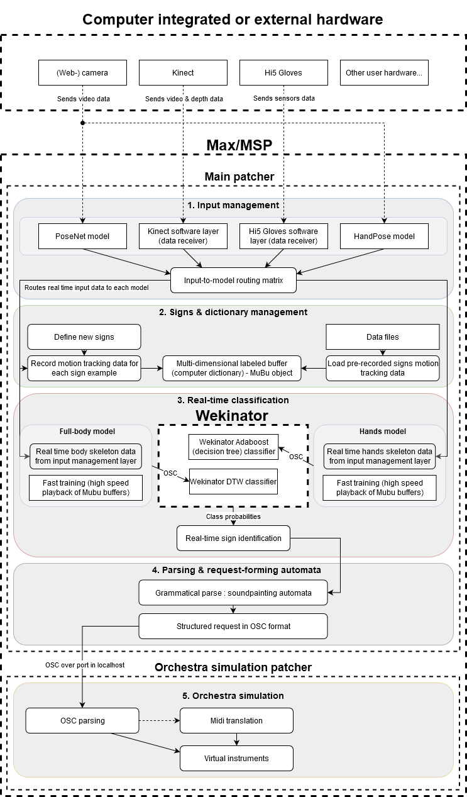

# Soundpainting recognition tool

* Are you a soundpainter?
* Or do you want to control your live artistic digital setup with your own signs and gestures?

This tool is made for you!

As part of my master thesis at EPFL (Switzerland) at the EM+ lab, I am building an app with Max/MSP that allows the user to control a virtual orchestra with soundpainting or user-created signs.

## [Features] I don't know Soundpainting, so what can I do with this?

Check out a little preview of the patcher : https://www.youtube.com/watch?v=OmPFMT9mgOs

Soundpainting is a sign language designed and used by composers to compose in real-time with multi-disciplinary performers (musicians, actors, visual artists, dancers...). Although it was first used and created by Walter Thompson, many other soundpainters have created their own signs for specific performances, just like you can do with this tool! Here is actually the list of features of my tool:

- Create and train your own signs. For instance, you could create a sign for "launch my program.exe". The program has been built to recognize common Soundpainting signs but you can just build the ones you need!
- Record your signs, save them to files and build your own dictionary of signs.
- Use the hardware you need: you can use the built-in motion capture models (PoseNet, HandPose, Hi5, Kinect...) but also connect your own with Max in little time. Once you have defined the number of features of your input, its name and connected the data pipeline to Max (for instance with OSC), you don't need anymore routing or spaguetthi patching! You can start building signs from very simple inputs, such as mouse, keyboards or your favorite midi controller if you want!
- Connect with as many Wekinator or Mubu machine learning models as you need for recognizing different types of signs: poses, movements, position in space...
- Create complex requests with the grammar of Soundpainting, which is optimized for real-time performance; but also creating your own regular grammar: your own sign language.
- Play with the built-in virtual orchestra or Ableton OSC controller and create your own set of sounds, triggers. With signs and gestures, you don't have to use hardware anymore to control you favorite DAW or software: your body can communicate with them.

The project has started with the following references in mind :
* MiMu Gloves https://mimugloves.com/ (extending music instruments with gestual controls)
* GeKiPe http://philippespiesser.com/projet/gekipe-geste-kinect-percussion/ (creating/extending music instruments with mechanical, percussion-like movements)
* Soundpainting as a standard, world-wide language for artistic performance, communication and composition http://www.soundpainting.com/

Each of these is an example of the performativity and potential of gestures and signs for music creativity, composition and instrument expansion.

## I don't get it, what is the link between Soundpainting and this Max patcher?

Soundpainting is a sign language that is used commonly between human perfomers, to communicate between each other or with a composer during the performance. For instance, using Soundpainting, you can form a request such as: "Guitar 1, improvise, with, jazz, feel, slowly enter" or "Dancer 2, make a loop, in relation with, guitar 1, now".

Now we all know how cool can computer-assisted music or tools can be and the potential they offer. My experience with Soundpainting is that synthetizers, mixing devices, effects... can be painful to manipulate in real-time performance. With this tool, you can manipulate them directly from Soundpainting signs (or your own!): you can program them to respond to commands that you will be able to send with your body... and this recognition tool.

As for now, only basic parts of the Soundpainting grammar are implemented in this tool. There are plenty of modes in Soundpainting that could be added later in the future, that will allow to create different request structures. But if you are a beginner in Soundpainting and want to explore what you can so with some basic signs and your own sounds, this is the right tool for you. Then if you want to code your own regular language and get deeper in the interfacing possibilities, that's also the right place to start.

## General project structure

## Required and recommended hardware

* Required: webcam OR low-latency external camera OR kinect input
* Required: 64 bits computer (Tested on Windows 10)
* Recommended with webcam input: Dedicated GPU (Tested on Nvidia 1060 GTX)
* Recommended: 16+ Go RAM, i7 or i9 CPU (Tested on i7-8750H)

## Standalone app

_Standalone apps will be released near june/july. Before that, you need to check the setup procedure (very simple) in order to access the source patcher and try it._

## Setup procedure

_For now, this is the only valid procedure. It has some additional requirements, including Max/MSP that is not free, but with which I am building this app._

1. Install Max/MSP (lastest version) https://cycling74.com/
2. _For use with Kinect input_ Install Processing https://processing.org/ and launch the "simpleKinect" scripts in the "Utilities" folder.
3. Download/clone this repository
4. Go to the "Main_patch" folder and load the lastest version of the patcher into Max/MSP (.maxpat)
5. _For use with the built-in HandPose & PoseNet - webcam - inputs (recommended)_ Install the dependencies by clicking on the dedicated button in the patcher. Then, make sure that the Maxhelper process (Max Helper.exe on windows) as well as the electron processes run on the dedicated GPU and not integrated GPU, by checking your OS or GPU settings (if you have a Nvidia GPU, check its control panel).
6. Install the required Max/MSP packages: MuBu, Bach project (and whatever Max/MSP is telling you that you are missing, because I used several handy packages for Max)
7. _For use with Kinect input_ Download the drivers for your kinect and launch the processing scripts located in the "Utilities" folder (check out https://github.com/jpbellona/simpleKinect).
8. Download Wekinator (wekinator.org) and launch as many models as you use in the patcher?
9. You can now use the tool! For instance, try to launch the PoseNet model with the Wekinator DTW model and train your first signs!
10. To build your own standalone, check out the procedure for Max/MSP (and Processing if you use the kinect scripts).

### Communication with Ableton Live

You can now use the tool to communicate with Ableton Live.

1. Install Ableton Live 10 (it may be compatible with Ableton live 9), for instance the free trial version.
2. Install a compatible version of LiveOSC. It is recommended to use the following: https://github.com/ideoforms/LiveOSC. The LiveOSC folder must be copied to the "MIDI Remote Scripts" folder of Ableton. On windows: "\ProgramData\Ableton\Live 10 Trial\Resources\MIDI Remote Scripts", on Mac it should appear under: "/Applications/Ableton*.app/Contents/App-Resources/" (unverified).
Then in Ableton Live:
* open File>Preferences
* under Link/MIDI, set Control Surface 1 to "LiveOSC"

## References

This project is based on the following tools:
* Posenet Node For Max: https://github.com/tejaswigowda/posenet-node-max
* Posenet for dummies https://github.com/billythemusical/n4m-posenet-for-dummies and original N4M posenet https://github.com/yuichkun/n4m-posenet
* N4M HandPose https://github.com/lysdexic-audio/n4m-handpose
* SimpleKinect https://github.com/jpbellona/simpleKinect
* Wekinator http://www.wekinator.org/
* Viz.js https://github.com/mdaines/viz.js
* Javascript state machine https://github.com/jakesgordon/javascript-state-machine
* The bach project (bachproject.net)
* and many Max/MSP packages...